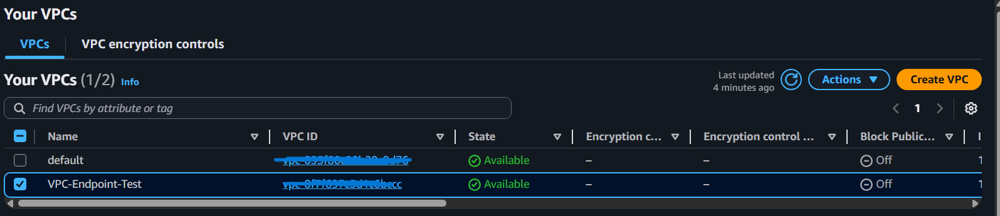
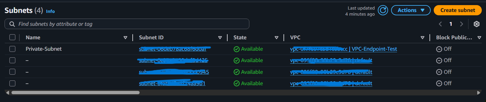
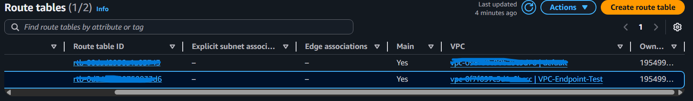
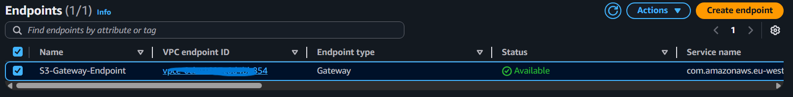
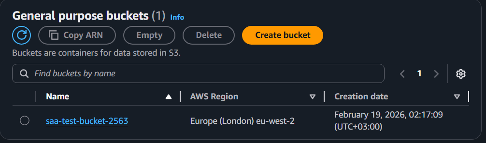
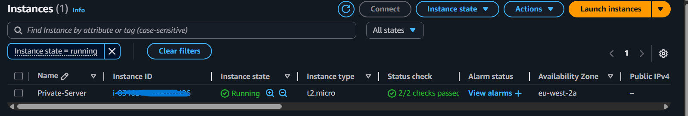
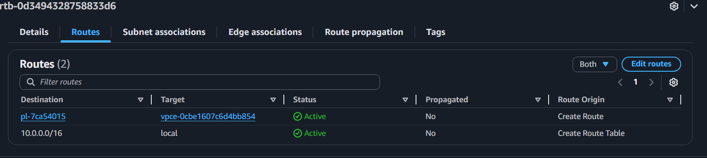

# VPC-Gateway-Endpoint-ile-Guvenli-ve-ucretsiz-S3-Erisimi

## Proje Özeti
Bu proje, **hiçbir internet erişimi olmayan** (Internet Gateway veya NAT Gateway bulunmayan) bir Özel Alt Ağ (Private Subnet) içindeki EC2 sunucusunun, **Amazon S3** servisindeki dosyalara nasıl güvenli bir şekilde erişebileceğini kanıtlamaktadır.

## Mimari Detaylar
- **VPC:** Özel oluşturulmuş ağ (10.0.0.0/16).
- **Subnet:** Tamamen izole edilmiş Özel Alt Ağ.
- **Servis:** Amazon S3.
- **Bağlantı Türü:** VPC Gateway Endpoint (Tür: Gateway).
- **Güvenlik:** EC2 üzerine tanımlanmış `S3ReadOnlyAccess` IAM Rolü.

## Sağladığı Avantajlar
1. **Maliyet Optimizasyonu:** NAT Gateway kullanımı saatlik ücrete tabidir. Ancak **VPC Gateway Endpoint tamamen ücretsizdir.**
2. **Üst Düzey Güvenlik:** Veriler asla halka açık internet üzerinden taşınmaz. Bu, veri sızıntısı riskini minimuma indirir.
3. **Performans:** Trafik doğrudan AWS omurgası üzerinden aktığı için daha düşük gecikme (latency) sağlar.

## Uygulama Adımları
1. Özel bir VPC ve internet çıkışı olmayan bir Subnet oluşturuldu.
2. Test amaçlı bir S3 Bucket oluşturuldu ve içine örnek bir dosya yüklendi.
3. EC2'nin S3'ü okuyabilmesi için gerekli IAM Rolü atandı.
4. Sunucu interneti olmayan subnet içinde başlatıldı.
5. VPC konsolundan **S3 Gateway Endpoint** oluşturuldu ve ilgili Rota Tablosuyla ilişkilendirildi.

 

